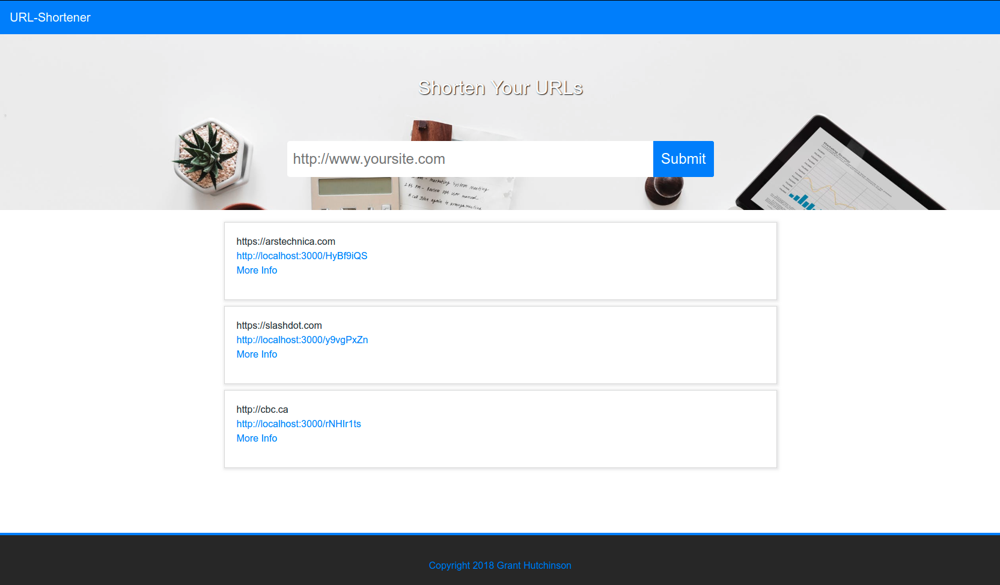

# React URL Shortener Example

A simple URL shortener service example.

<a href="https://github.com/hutchgrant/url-shortener/raw/master/docs/screenshot.png"></a>
<a href="https://github.com/hutchgrant/url-shortener/raw/master/docs/screenshot2.png"></a>

### Purpose

Demonstrate a quick example of a front and backend react/node.js/mongo application based on the given requirements

### Install

```
npm run install-all
```

### Configure

Edit ./config/keys.js with your mongodb URI

```
mongoURI: 'mongodb://127.0.0.1/url-shortner'
```

Redux Dev Tools can be enabled in ./client/src/index.js

### Development

```
npm run dev
```

React frontend should be accessible at http://localhost:3000 and the Node.js backend is accessible at http://localhost:5000
